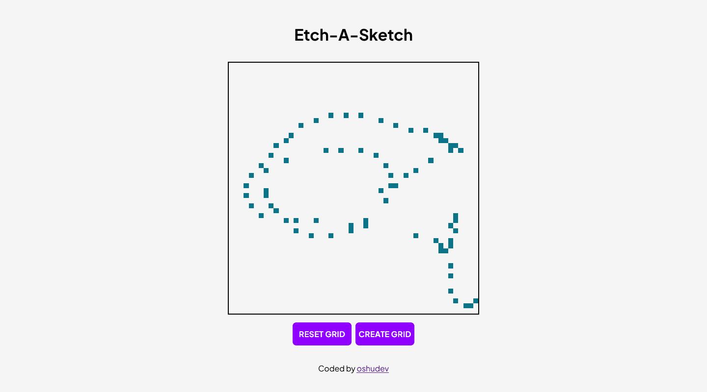

# Etch A Sketch

In this project, I get to practice my DOM manipulation skills.

## Overview

### The Challenge

Build a browser version of something between a sketchpad and an Etch-A-Sketch.

-   Users should be able to enter custom grid size.
-   Users should be able to reset the canvas.

### Screenshot

## Built with

-   Semantic HTML5
-   CSS
-   Vanila JS

## Improvement

This project is not mobile friendly. I only intend this to be a desktop first design.
